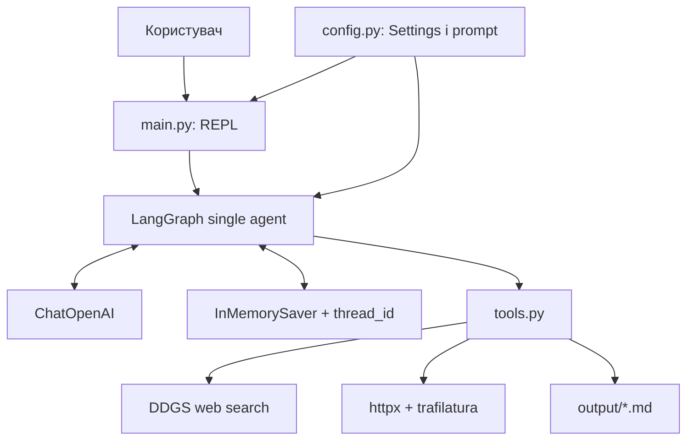
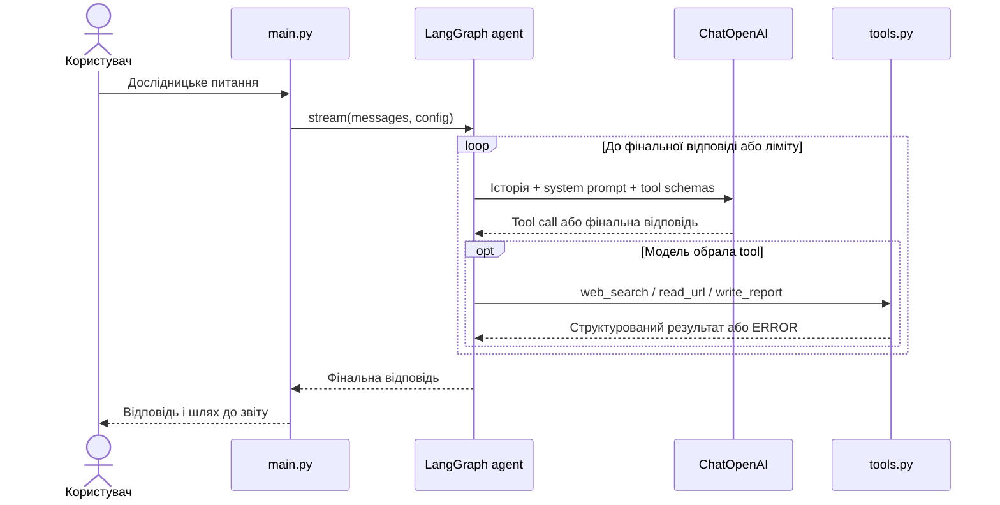

# Research Agent

Research Agent — інтерактивний CLI-застосунок, який приймає дослідницьке
питання, самостійно шукає джерела в інтернеті, читає релевантні сторінки та
зберігає структурований Markdown-звіт.

Проєкт реалізований як **single-agent** система на LangChain і LangGraph.
Порядок виклику інструментів не захардкоджений: модель сама вирішує, коли
виконати пошук, які сторінки прочитати та коли записати готовий звіт.

## Можливості

- інтерактивний REPL із командами `exit` і `quit`;
- multi-step дослідження через `web_search`, `read_url` і `write_report`;
- пам'ять діалогу в межах одного запуску програми;
- обмеження кількості tool calls і аварійний recursion limit;
- обрізання великих результатів перед передаванням у контекст моделі;
- безпечний запис Markdown-звітів лише в директорію `output/`;
- короткі повідомлення про помилки без traceback, секретів і системних деталей;
- тести без реальних OpenAI API-викликів і мережевих запитів.

## Архітектура

`main.py` створює одну конфігурацію, один скомпільований граф агента й один
`thread_id` на всю CLI-сесію. Агент використовує `ChatOpenAI`, три tools та
`InMemorySaver`. `config.py` централізує settings, ліміти й system prompt.



### Послідовність виконання запиту



## Вимоги

- Python **3.12**;
- доступ до інтернету для `web_search` і `read_url`;
- OpenAI API key;
- Windows PowerShell або Git Bash для наведених нижче команд.

## Встановлення

### PowerShell

```powershell
git clone https://github.com/felkost/Multi-Agent-systems-homework-lesson-3.git
Set-Location Multi-Agent-systems-homework-lesson-3
git switch feat/research-agent-core

py -3.12 -m venv .venv
.\.venv\Scripts\Activate.ps1

python -m pip install --upgrade pip
python -m pip install -r requirements.txt
```

### Git Bash на Windows

```bash
git clone https://github.com/felkost/Multi-Agent-systems-homework-lesson-3.git
cd Multi-Agent-systems-homework-lesson-3
git switch feat/research-agent-core

py -3.12 -m venv .venv
source .venv/Scripts/activate

python -m pip install --upgrade pip
python -m pip install -r requirements.txt
```

Перевірити активну версію Python:

```bash
python --version
```

Очікується Python 3.12.x.

### Dev-залежності

Для запуску тестів, форматування та статичного аналізу встановіть:

```bash
python -m pip install pytest black flake8 mypy
```

Production-залежності встановлюються з `requirements.txt`; dev-інструменти не
потрібні для звичайного запуску агента.

## Налаштування `.env`

`.env` не можна додавати до Git. Він уже виключений через `.gitignore`.

### PowerShell

```powershell
Copy-Item .env.example .env
```

### Git Bash

```bash
cp .env.example .env
```

Відкрийте `.env` і встановіть значення:

```dotenv
OPENAI_API_KEY=sk-your-real-key
MODEL_NAME=gpt-4o-mini
```

| Змінна | Обов'язкова | Призначення |
|---|---:|---|
| `OPENAI_API_KEY` | так | Ключ для запитів до OpenAI API. |
| `MODEL_NAME` | ні | Модель; за замовчуванням `gpt-4o-mini`. |

`SecretStr` маскує ключ у представленні settings. Об'єкт `Settings` створюється
через `load_settings()` під час запуску, тому імпорт модулів не вимагає ключа.

## Запуск

```bash
python main.py
```

Приклад сесії:

```text
Research Agent (type 'exit' to quit)
----------------------------------------

You: Порівняй особливості життя бурого ведмедя, євразійської рисі та
сірого вовка в Українських Карпатах: середовище існування, харчування,
поведінку, природоохоронний статус і основні загрози.

Tool: web_search
Tool: web_search
Tool: read_url
Tool: read_url
Tool: write_report

Agent: Дослідження завершено. Звіт збережено за шляхом:
.../output/carpathian_wildlife_comparison.md

You: exit
Goodbye!
```

Кількість і порядок tool calls визначає модель, тому фактичний журнал може
відрізнятися. CLI показує лише назви tools і фінальну відповідь, без приватного
chain-of-thought та без повного тексту завантажених сторінок.

## Інструменти

| Tool | Вхід | Результат | Призначення |
|---|---|---|---|
| `web_search` | `query: str` | `list[SearchResult]` або `ERROR` | Виконує DuckDuckGo-пошук через `DDGS`, нормалізує поля, видаляє дублікати URL і скорочує snippets. |
| `read_url` | `url: str` | текст сторінки або `ERROR` | Приймає лише HTTP/HTTPS, завантажує сторінку через `httpx`, виділяє основний текст через `trafilatura`. |
| `write_report` | `filename`, `content` | абсолютний шлях або `ERROR` | Нормалізує ім'я, примусово додає `.md` і записує UTF-8 файл усередині `output/`. |

Tool-помилки повертаються агенту як короткі рядки `ERROR: ...`. Помилка одного
джерела не повинна завершувати REPL: модель може обрати інший URL або продовжити
з уже зібраними даними.

## Пам'ять і `thread_id`

На початку роботи `main.py` генерує один UUID і передає його як `thread_id` у
кожний виклик агента цієї сесії. `InMemorySaver` використовує цей ідентифікатор
для завантаження історії, тому follow-up на кшталт «додай рекомендації до
попереднього порівняння» бачить попередній контекст.

Інший `thread_id` створює ізольовану розмову. Пам'ять зберігається лише в RAM і
втрачається після завершення процесу `python main.py`.

## Context engineering

Ліміти визначені в `Settings`:

| Параметр | Значення за замовчуванням | Дія |
|---|---:|---|
| `max_search_results` | `5` | Максимальна кількість кандидатів одного пошуку. |
| `max_search_snippet_length` | `500` | Максимальна довжина одного search snippet. |
| `max_url_content_length` | `5000` | Максимальна довжина тексту, повернутого `read_url`. |
| `http_timeout_seconds` | `10.0` | Таймаут завантаження сторінки. |
| `output_dir` | `output` | Директорія для згенерованих звітів. |

Обрізання відбувається до повернення tool result моделі. Якщо текст сторінки
перевищує ліміт, `read_url` додає позначку `[Content truncated ...]`.

## Ліміти виконання

| Ліміт | Значення | Призначення |
|---|---:|---|
| `max_tool_calls` | `10` | Run-scoped ліміт `ToolCallLimitMiddleware` для одного запиту користувача. |
| `recursion_limit` | `25` | Аварійний backstop LangGraph для виконання графа. |

Run-scoped ліміт починається заново для кожного повідомлення. Він не
накопичується між follow-up у межах одного `thread_id`.

## Тестування і перевірка якості

Тести використовують fake-модель та mocks мережі, тому не повинні витрачати
OpenAI API tokens або виконувати реальні HTTP-запити.

Запустити тести:

```bash
python -m pytest -q
```

Запустити всі локальні перевірки:

```bash
black --check config.py tools.py agent.py main.py tests
flake8 config.py tools.py agent.py main.py tests
mypy config.py tools.py agent.py main.py tests
python -m pytest -q
```

Окремі групи тестів:

```bash
python -m pytest tests/test_config.py -q
python -m pytest tests/test_tools.py -q
python -m pytest tests/test_memory.py -q
```

## Приклад звіту

Перевірений приклад згенерованого Markdown-звіту розміщується у
[`example_output/report.md`](example_output/report.md). Робочі звіти агент
створює в `output/`.

Перед публікацією прикладу потрібно вручну відкрити використані джерела й
видалити або пом'якшити твердження, які вони не підтверджують.

## Структура проєкту

```text
.
├── main.py
├── agent.py
├── tools.py
├── config.py
├── requirements.txt
├── pyproject.toml
├── .env.example
├── tests/
│   ├── test_config.py
│   ├── test_tools.py
│   └── test_memory.py
├── output/
│   └── *.md
├── example_output/
│   └── report.md
└── README.md
```

## Відомі обмеження

- `InMemorySaver` не зберігає діалог після завершення процесу.
- Результати DDGS і доступність сторінок залежать від зовнішніх сервісів;
  можливі rate limits, timeout або тимчасові помилки.
- `trafilatura` може не виділити текст із JavaScript-heavy, paywalled або
  нетипово структурованих сторінок.
- URL-перевірка обмежена схемами HTTP/HTTPS і не є повним SSRF-захистом.
- Обрізання залишає перші N символів сторінки, тому важлива інформація наприкінці
  може не потрапити в контекст.
- Якість висновків залежить від моделі та джерел. Згенеровані твердження потрібно
  перевіряти перед публікацією.
- Досягнення `max_tool_calls` або `recursion_limit` може завершити дослідження до
  опрацювання всіх потенційних джерел.

## Безпека

- не додавайте `.env` або API-ключі до Git;
- не вставляйте ключі у prompts, звіти чи повідомлення про помилки;
- вміст вебсторінок вважається недовіреним і не повинен змінювати інструкції
  агента;
- перевіряйте джерела та Markdown-звіт перед публікацією.
